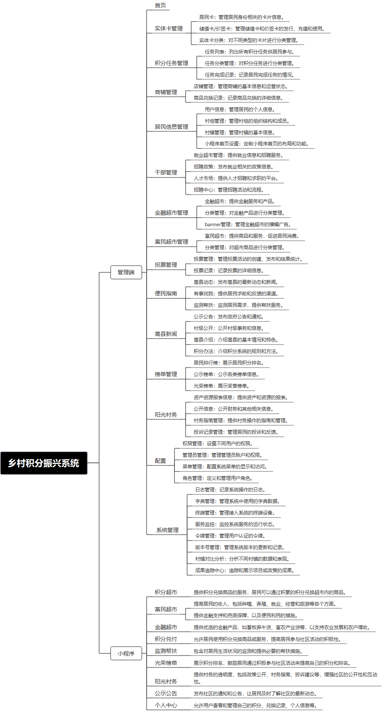

 

    
 

公司拥有上百套具有自主知识产权的软件系统，详情请查看码云首页或公司官网

 
<h1>文明积分银行</h1>

<a href="https://www.haishi.net.cn/">公司官网</a> ｜ <a href="https://www.haishi.net.cn/">在线体验</a>

 

## 系统介绍

“文明积分银行”与乡村振兴、乡风文明建设结合，形成常态化服务和管理模式。通过平台积分任务，结合乡村环境建设、精神文明建设、土地治理、无公害生产等建设需求，设置合理的积分获取、消费体系，激发村民、乡村企业的乡风文明建设热情。
“文明积分银行”与乡村振兴、乡风文明建设结合，形成常态化服务和管理模式。通过平台积分任务，结合乡村环境建设、精神文明建设、土地治理、无公害生产等建设需求，设置合理的积分获取、消费体系，激发村民、乡村企业的乡风文明建设热情。
本项目名称为嵩县乡村振兴积分超市系统，旨在通过积分制度鼓励村民参与乡村振兴建设，并提供商品兑换服务。
本项目从用户层面至少包含三个端：小程序端、村干部Web端、商户Web端
- 小程序端：村民用户使用，可以进行登录、获取积分、积分购物、查看村干部发布的信息、参与投票活动等。
- 村干部Web端：村干部用户使用，可以进行登录、管理村户数据、发布负向扣分、审核村民提交的信息等。
- 商户Web端：商户用户使用，可以进行商品兑换操作，管理兑换记录等。
                

## 系统功能介绍

### 系统包含终端说明

管理端（WEB）、用户端（微信小程序）

| 序号 | 模块 | 模块说明 |
| --- | --- | --- |
| 1 | ZF-XCZX-WMJFYH-MP | 小程序 |
| 2 | ZF-XCZX-WMJFYH-SERVER | 服务端 |

### 系统功能结构

### 系统功能说明

- 居民身份操作流程：村民可进行登录、获取积分、积分购物、查看村干部发布的信息、参与投票活动等
- 村干部身份操作流程：村干部可进行登录、管理村户数据、发布负向扣分、审核村民提交的信息等
- 商户身份操作流程：商户可进行商品兑换操作，管理兑换记录等

## 系统主要界面

## 系统技术说明

### 代码模块说明

| 序号 | 目录 | 目录说明 |
| --- | --- | --- |
| 1 | ZF-XCZX-WMJFYH-SERVER/point-common | -- |
| 2 | ZF-XCZX-WMJFYH-SERVER/point-biz | -- |

### 系统技术选型

#### 开发语言/框架

JAVA（JDK1.8）
前端框架：VUE2

#### 服务中间件

Nginx
Tomcat

#### 数据库

MySQL（5.7+）
Redis

#### 其他说明

无

## 系统演示/商用

请扫码添加客服微信获取演示地址和系统详细资料。

如果您想基于文明积分银行进行商业化交付或定制开发服务，我们提供有偿的技术服务支持，合作模式不限，欢迎沟通！

公司官网地址： <a href="https://www.haishi.net.cn/">https://www.haishi.net.cn</a>

联系客服获取专业回答。

## 使用须知

1、 本项目商用必须获得版权所有者的授权。

2、 未经允许本项目代码不允许二次出售。

